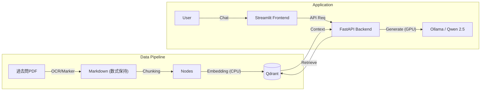

# Grad-Exam-RAG: ローカル完結型 院試対策AIアシスタント

大学院入試（数学・情報系）の過去問PDFを学習し、数式を含む高度な質問に回答するRAG（Retrieval-Augmented Generation）アプリケーション。
外部API（OpenAI等）を使用せず、**RTX 3060 (12GB)** 搭載のローカルPC上で、OCRから推論まで全てのパイプラインを完結させています。

## 📸 Demo

*(ここに後でStreamlitのチャット画面のスクリーンショットを貼ると完璧です)*

## 🏗 Architecture

# Clone repository
git clone [https://github.com/your-name/grad-exam-rag.git](https://github.com/your-name/grad-exam-rag.git)
cd grad-exam-rag

# Install dependencies
pip install -r requirements.txt

# Start Vector DB
docker-compose up -d

# 指定したPDFをOCRにかけてDBに登録
python -m app.services.import_pdf ./data/sample_exam.pdf

# Start Backend API
uvicorn app.main:app --reload

# Start Frontend UI (in a new terminal)
streamlit run frontend.py
