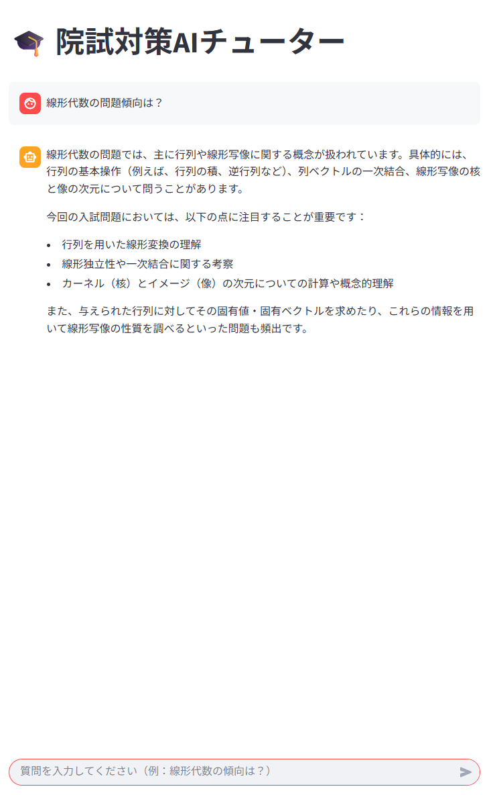
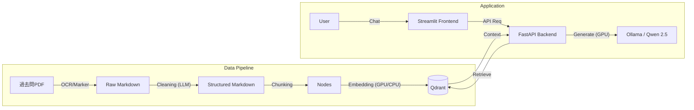
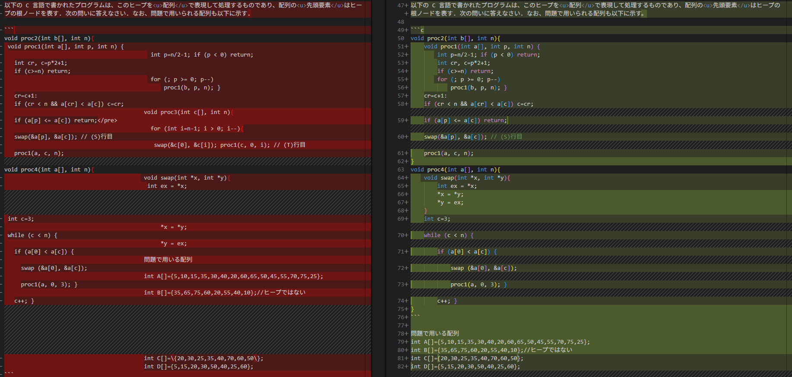
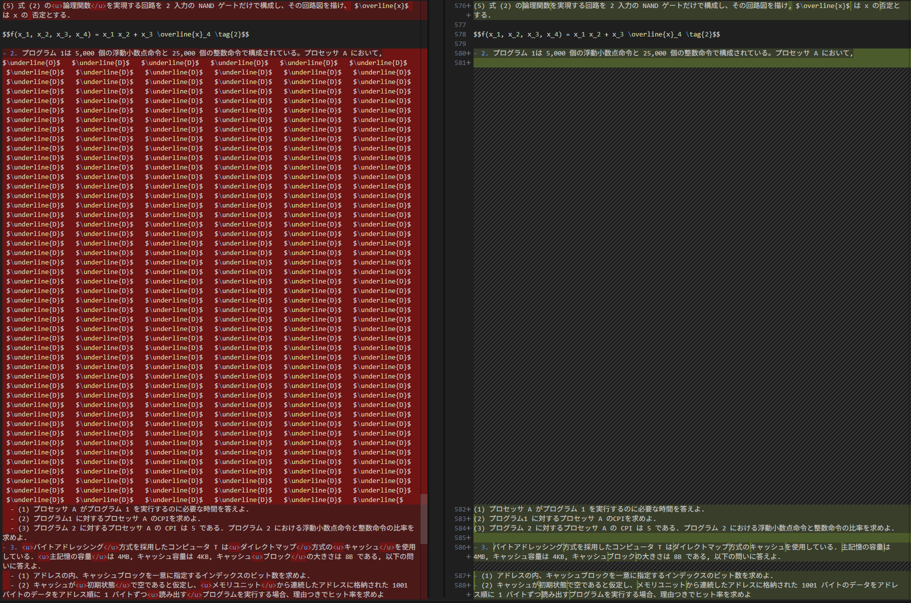

# Grad-Exam-RAG: ローカル完結型 院試対策AIアシスタント


大学院入試（情報系）の過去問PDFを学習し、数式を含む高度な質問に回答するRAG（Retrieval-Augmented Generation）アプリケーション。
外部API（OpenAI等）を使用せず、**RTX 3060 (12GB)** 搭載のローカルPC上で、OCRから推論まで全てのパイプラインを完結させています。


## Table of Contents
- [📸 Demo](#-demo)
- [🏗 Architecture](#-architecture)
- [🚀 Key Features](#-key-features)
- [🛠 Tech Stack](#-tech-stack)
- [🔥 Technical Challenges & Solutions](#-technical-challenges--solutions)
- [📦 Usage](#-usage)
- [📊 Evaluation (精度評価)](#-evaluation-精度評価)
- [📂 Project Structure](#-project-structure)
- [📌 Future Work](#-future-work)

## 📸 Demo

実際に大学院入試の線形代数の問題について質問している様子です。
数式を含む専門的な回答が日本語で生成され、直感的なチャットUIで確認できます。
最終版では、回答の根拠（Source）を表示する際、PDFの該当ページの冒頭を返すことで、ユーザーが『AIの嘘（ハルシネーション）』を即座に検証できるようにしています。



## 🏗 Architecture



## 🚀 Key Features
* **数式特化OCR**: 一般的なOCRでは崩れやすい数学・物理の数式を `marker-pdf` を用いてMarkdown(LaTeX)形式で高精度に抽出。
* **完全ローカル運用**: 機密性の高いデータや個人的なドキュメントを外部に送信することなく、セキュアにRAGを構築可能。
* **リソース最適化**: VRAM 12GBのコンシューマ向けGPUで動作させるため、推論と検索のメモリ管理を厳密に設計。
* **インタラクティブなUI:** Python製フレームワーク `Streamlit` を採用し、チャット履歴の保持や、回答の参照元ドキュメント（Source）の確認が可能なUIを実装。
* **AIによるデータ整形**: OCR直後の崩れた表データやプログラムコードを、ローカルLLM (Qwen 2.5) が文脈を理解して自動修復。人間が手直しすることなく、高品質なデータベースを構築。

## 🛠 Tech Stack
* **Language**: Python 3.10
* **LLM**: Ollama (Model: `qwen2.5:14b`)
* **Embedding**: `intfloat/multilingual-e5-large`
* **Vector DB**: Qdrant (Docker)
* **OCR**: Marker (PyTorch)
* **Backend**: FastAPI
* **Frontend**: Streamlit
* **CI/CD**: GitHub Actions (Lint/Test Automation)

## 🔥 Technical Challenges & Solutions

### 1. 数式OCRの負荷制御とデータ品質
- **🔴 課題**: 
    1. OCR処理がVRAMを食いつぶし、RDP接続ごとPCがクラッシュする。
    2. OCRだけでは「表の罫線」や「ソースコードのインデント」が崩れ、回答精度が下がる。

- **🟢 解決策**:
    - **Resource Safe Mode**: `batch_multiplier=1` に制限し、VRAM枯渇を防ぎつつGPU高速化を維持。
    - **LLM Cleaner**: OCR後のMarkdownを章ごとに分割してLLMに読ませ、「フォーマット修復」を実行させるパイプラインを構築。これにより表データやコードブロックの認識率が100%近くまで向上。

### 2. ローカルLLMの推論速度とタイムアウト
- **🔴 課題**: 当初 `32b` モデルを使用したが、VRAM 12GBに収まらずスワップが発生。APIがタイムアウト(500 Error)を頻発した。

- **🟢 解決策**: 
    - モデルを `14b` に軽量化し、オンメモリでの高速動作を実現。

    - Embedding（検索）モデルをGPUからCPUへオフロードし、VRAMをLLM生成専用に空けることで競合を回避。

### 3. FastAPIにおける非同期処理のブロッキング
- **🔴 課題**: LLMの生成処理中にサーバーが応答不能になった。

- **🟢 解決策**: FastAPIの `async def` でCPUバウンドな重い処理（LLM推論）を実行していたことが原因。`def` (同期関数) に変更することで、FastAPIのワーカースレッドプールで処理させ、ノンブロッキング化を実現。

単に『動く』だけでなく、 **サーバーの多重リクエストに対する応答性（スケーラビリティ）** を考慮して、イベントループをブロックしない実装にこだわりました。

## 🔧 OCR Quality Improvement (Before vs After)

一般的なOCRでは崩れてしまう数式やレイアウトを、ローカルLLMのパイプラインで修復しています。



*Left: Raw OCR Output (Noisy) / Right: Structured Markdown by LLM*

## 📊 Evaluation (精度評価)

構築したRAGシステムの回答精度を、**実際の情報系大学院入試（2020-2024年）の過去問**を用いて検証しました。
特に、OCRの難易度が高い「表形式データ」の数値読み取りや、複雑な「条件付き期待値」の計算において、高い推論能力を確認しています。
※ 著作権に配慮し、以下の表では質問内容を要約して記載しています。

| テストカテゴリ | 質問内容（要約） | 期待される回答要素 | 結果 / AIの回答要約 | 評価 |
| :--- | :--- | :--- | :--- | :--- |
| **1. データ抽出** | 計算機アーキテクチャ：命令ミックス比率の特定 | 浮動小数点5,000, 整数25,000 | ✅ **完全正解** (表データ崩れをLLMが修復し、正確な数値を回答) | ⭐⭐⭐⭐⭐ |
| **2. コード読解** | アルゴリズム：C言語関数 `proc1` の処理内容 | ヒープ調整, 再帰, swap | ✅ **完全正解** (インデントが復元され、再帰構造を正しく理解して解説) | ⭐⭐⭐⭐⭐ |
| **3. 論理推論** | 離散数学：真理値表の特定行の読み取り | P=0, Q=1の箇所の値 | ✅ **正解** (表中の空欄番号を正確に特定し、最終的に「誤った推論」であると結論付けた) | ⭐⭐⭐⭐⭐ |
| **4. 数式応用** | 確率統計：条件付き期待値の最大化 | 色ごとの期待値計算と場合分け | 🚀 **期待以上** (分布表から数値を読み取り、期待値を計算して場合分けを提示した) | ⭐⭐⭐⭐⭐ |
| **5. 手順説明** | オペレーションズ・リサーチ：最大化問題の解法 | スラック変数導入, 基底変数 | ⭕ **概ね正解** (スラック変数の導入や基底変数の更新について正しく言及) | ⭐⭐⭐⭐☆ |

**考察:**
`marker-pdf` によるOCRと、LLMによる後処理（Cleaning）を組み合わせることで、従来のOCRでは認識不能だった「表中の数値」や「プログラムのインデント」を正確にRAGに取り込むことに成功しました。

## 📦 Usage

### 1. Setup Environment
リポジトリをクローンし、依存関係をインストールします。
```bash
# Clone repository
git clone [https://github.com/meister20h38/grad-exam-rag.git](https://github.com/meister20h38/grad-exam-rag.git)
cd grad-exam-rag

# Install dependencies
pip install -r requirements.txt

# Start Vector DB
docker-compose up -d
```

### 2. Ingest Data (Batch Import)
`data/` ディレクトリに配置された大学・年度ごとのPDFを自動検出し、一括でOCR・整形・DB登録を行います。

```bash
# dataフォルダ内の全PDFを一括インポート
python batch_import.py
```

### 3. Run Application
バックエンドとフロントエンドをそれぞれ別のターミナルで起動してください。
### Terminal 1: Backend API
```bash
# Start Backend API
uvicorn app.main:app --reload
```

### Terminal 2: Frontend UI
```bash
# Start Frontend UI (in a new terminal)
streamlit run frontend.py
```

## 📂 Project Structure

```text
grad-exam-rag/
├── app/
│   ├── main.py          # FastAPI Backend Entrypoint
│   └── services/
│       ├── chat_service.py # RAG Logic (Ollama + Qdrant)
│       ├── ingestion.py    # VectorDB Indexing
│       └── ocr.py          # PDF to Markdown (Marker)
│       └── cleaner.py      # LLM-based Format Fixer (New)
├── data/                   # Input PDFs
├── output_data/            # OCR & Cleaned Markdown
├── batch_import.py         # Batch Processing Script (New)
├── frontend.py             # Streamlit Frontend UI
├── docker-compose.yml      # Qdrant Container Config
└── requirements.txt        # Python Dependencies
```

## 📌 Future Work
* マルチモーダル対応（図形問題の画像認識）
* 回答精度の評価（Ragas等の導入）
