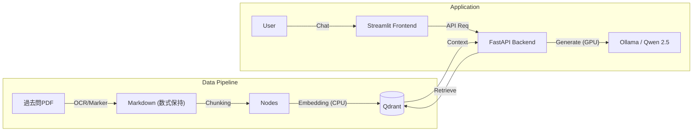

# Grad-Exam-RAG: ローカル完結型 院試対策AIアシスタント

大学院入試（数学・情報系）の過去問PDFを学習し、数式を含む高度な質問に回答するRAG（Retrieval-Augmented Generation）アプリケーション。
外部API（OpenAI等）を使用せず、**RTX 3060 (12GB)** 搭載のローカルPC上で、OCRから推論まで全てのパイプラインを完結させています。


## 📸 Demo

実際に大学院入試の線形代数の問題について質問している様子です。
数式を含む専門的な回答が日本語で生成され、直感的なチャットUIで確認できます。


## 🏗 Architecture



## 🚀 Key Features
* **数式特化OCR**: 一般的なOCRでは崩れやすい数学・物理の数式を `marker-pdf` を用いてMarkdown(LaTeX)形式で高精度に抽出。

* **完全ローカル運用**: 機密性の高いデータや個人的なドキュメントを外部に送信することなく、セキュアにRAGを構築可能。

* **リソース最適化**: VRAM 12GBのコンシューマ向けGPUで動作させるため、推論と検索のメモリ管理を厳密に設計。

* **インタラクティブなUI:** Python製フレームワーク `Streamlit` を採用し、チャット履歴の保持や、回答の参照元ドキュメント（Source）の確認が可能なUIを実装。

## 🛠 Tech Stack
* **Language**: Python 3.10

* **LLM**: Ollama (Model: `qwen2.5:14b`)

* **Embedding**: `intfloat/multilingual-e5-large`

* **Vector DB**: Qdrant (Docker)

* **OCR**: Marker (PyTorch)

* **Backend**: FastAPI

* **Frontend**: Streamlit

## 🔥 Technical Challenges & Solutions

### 1. 数式OCR時のVRAM枯渇とRDPクラッシュ
- **🔴 課題**: marker-pdf によるOCR処理がGPUとメインメモリを食いつぶし、リモートデスクトップ(RDP)接続ごとしばしばダウンした。

- **🟢 解決策**: 
    - OCRプロセス専用のリソース制限クラスを実装。

    - PyTorchの利用スレッド数（`OMP_NUM_THREADS`等）を物理コア数未満に制限し、OS維持用のリソースを確保。

    - OCR時はあえてGPUを無効化(`CUDA_VISIBLE_DEVICES=""`)し、安定性を優先。

### 2. ローカルLLMの推論速度とタイムアウト
- **🔴 課題**: 当初 `32b` モデルを使用したが、VRAM 12GBに収まらずスワップが発生。APIがタイムアウト(500 Error)を頻発した。

- **🟢 解決策**: 
    - モデルを `14b` に軽量化し、オンメモリでの高速動作を実現。

    - Embedding（検索）モデルをGPUからCPUへオフロードし、VRAMをLLM生成専用に空けることで競合を回避。

### 3. FastAPIにおける非同期処理のブロッキング
- **🔴 課題**: LLMの生成処理中にサーバーが応答不能になった。

- **🟢 解決策**: FastAPIの `async def` でCPUバウンドな重い処理（LLM推論）を実行していたことが原因。`def` (同期関数) に変更することで、FastAPIのワーカースレッドプールで処理させ、ノンブロッキング化を実現。

## 📦 Usage

### 1. Setup Environment
リポジトリをクローンし、依存関係をインストールします。
```bash
# Clone repository
git clone [https://github.com/your-name/grad-exam-rag.git](https://github.com/your-name/grad-exam-rag.git)
cd grad-exam-rag

# Install dependencies
pip install -r requirements.txt

# Start Vector DB
docker-compose up -d
```

### 2. Ingest Data (PDF to Vector DB)
指定したPDFをOCRにかけてDBに登録します。 ※ 初回実行時はOCRモデルのダウンロードが行われます。
```bash
# 指定したPDFをOCRにかけてDBに登録
python -m app.services.import_pdf ./data/sample_exam.pdf
```

### 3. Run Application
バックエンドとフロントエンドをそれぞれ別のターミナルで起動してください。
### Terminal 1: Backend API
```bash
# Start Backend API
uvicorn app.main:app --reload
```

### Terminal 2: Frontend UI
```bash
# Start Frontend UI (in a new terminal)
streamlit run frontend.py
```

## 📌 Future Work
* マルチモーダル対応（図形問題の画像認識）

* 回答精度の評価（Ragas等の導入）

## 📂 Project Structure

```text
grad-exam-rag/
├── app/
│   ├── main.py          # FastAPI Backend Entrypoint
│   └── services/
│       ├── chat_service.py # RAG Logic (Ollama + Qdrant)
│       ├── ingestion.py    # VectorDB Indexing
│       └── ocr.py          # PDF to Markdown (Marker)
├── data/                   # Input PDFs
├── frontend.py             # Streamlit Frontend UI
├── docker-compose.yml      # Qdrant Container Config
└── requirements.txt        # Python Dependencies
```
